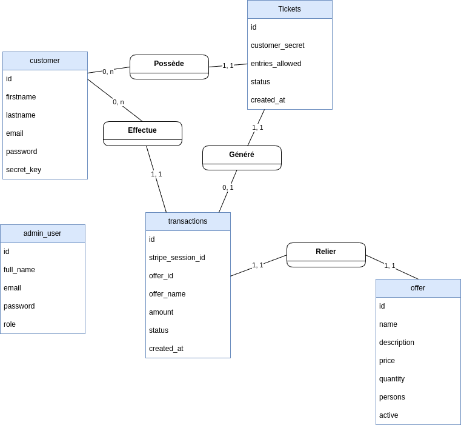

# Documentation technique – Billetterie JO 2024

## 1. Aperçu du projet

- **Objectif** : exposer une API Spring Boot pour gérer la vente, le paiement et le contrôle de e-billets lors des Jeux
  Olympiques 2024.
- **Pile technique** : 
  - Java 21
  - Spring Boot 3 (Web, Security, Validation, Data JPA, Mail), Stripe SDK, JWT (jjwt), Lombok, MySQL, tests JUnit 5.
- **Publics ciblés** : trois profils (visiteurs non authentifiés, clients authentifiés et administrateurs / agents de contrôle)
- **Livrables connexes** : front-end public, back-office administrateur et interface de scan (non présents dans ce
  dépôt, l'API fournit les services nécessaires).

## 2. Architecture applicative

Organisation par domaines dans `src/main/java/studi/doryanbessiere/jo2024` :

```
├── common               # DTOs, routes, exceptions, validations (`dto`, `exceptions`, `validation/password`, `validation/unique`)
├── config               # Configuration Spring / Stripe et un seeder[compte admin] (`DataInitializer.java`, `OpenApiConfig.java`, `SecurityConfig.java`, `StripeConfig.java`, `WebCorsConfig.java`)
├── notifications        # Service d'envoi d'e-mails (`EmailNotificationService.java`, `dto`)
├── rendering            # Moteur de templates (`TemplateEngine.java`, `TextTemplateEngine.java`, `templates`)
├── services             # Coeur métier (sous-packages : `admins`, `customers`, `offers`, `payments`, `tickets`)
│   ├── admins           # `AdminAuthController.java`, `AdminAuthService.java`, `Admin.java`, `AdminRepository.java`, `dto`
│   ├── customers        # `CustomerAuthController.java`, `CustomerAuthService.java`, `Customer.java`, `CustomerRepository.java`, `dto`
│   ├── offers           # `OfferController.java`, `OfferService.java`, `Offer.java`, `OfferRepository.java`
│   ├── payments         # `PaymentController.java`, `PaymentService.java`, `StripeWebhookController.java`, `Transaction.java`, `TransactionRepository.java`
│   └── tickets          # `TicketController.java`, `TicketService.java`, `Ticket.java`, `TicketRepository.java`, `dto`
└── shared               # Services partagés (`JwtService.java`, `security` aspects : `AdminOnly`, `CustomerOnly`)
```

Les contrôleurs REST exposent les endpoints publics, les services encapsulent la logique métier et les repositories
Spring Data JPA persistents utilisent une base MySQL (configurable).

Schema architecture : [https://excalidraw.com/#json=kW1RE2LWFbD9jQYJmal7C,Iiudqv7kNZxKyqhmhEGPwA](https://excalidraw.com/#json=kW1RE2LWFbD9jQYJmal7C,Iiudqv7kNZxKyqhmhEGPwA)

## 3. Modèle de données

Principales entités JPA :
- `Customer` : compte client avec secret unique (`secret_key`) utilisé pour lier les billets.
- `Admin` : compte d'administration avec rôle (`ADMIN` ou `SCANNER`).
- `Offer` : offre commerciale (nom, description, tarif, capacité, stock, statut actif).
- `Transaction` : trace Stripe (nom de l'offre à l'achat, montant, état `PENDING/PAID/FAILED`, identifiant de session
  Stripe, lien vers le client).
- `Ticket` : billet généré après paiement validé (secret unique pour QR code, statut `ACTIVE/USED`, nombre d'entrées,
  lien transaction/client).



Points clés :

- Les billets sont créés **uniquement** après réception de l'événement Stripe `checkout.session.completed`.
- Un ticket référence un client via le `customerSecret` (identifiant non sensible).
- Chaque transaction stocke un snapshot de l'offre achetée (nom, tarif) pour conserver l'historique même si l'offre
  évolue.
- Les validations liées aux mots de passe et e-mails s'appuient sur des annotations personnalisées (`@ValidPassword`,
  `@UniqueEmail`).

## 4. Flux métier principaux

### 4.1. Inscription et authentification

1. Un visiteur crée un compte via `POST /auth/customer/register`. Les validations `@ValidPassword`, `@PasswordMatches`
   et `@UniqueEmail` garantissent la qualité des données.
2. À la connexion `POST /auth/customer/login`, `CustomerAuthService` compare le mot de passe chiffré (BCrypt) et émet un
   JWT contenant les claims `role=CUSTOMER` et `uid`.
3. Le profil (`GET /auth/customer/me`) et la liste des billets (`GET /auth/customer/me/tickets`) nécessitent
   l'annotation `@CustomerOnly`, assurée par `CustomerOnlyAspect` qui valide le JWT.
4. Les parcours de réinitialisation de mot de passe émettent un token unique, stocké sur le compte et envoyé par email
   via `EmailNotificationService`.

### 4.2. Gestion administrateur

1. Les comptes admin sont créés la première fois par `DataInitializer` via les variables `ADMIN_DEFAULT_EMAIL`/
   `ADMIN_DEFAULT_PASSWORD`.
2. `POST /auth/admin/login` retourne un JWT `role=ADMIN`. Les routes annotées `@AdminOnly` (ex : gestion des offres,
   validation tickets) sont filtrées par `AdminOnlyAspect`.
3. Le back-office manipule les offres (`GET/POST/PUT/DELETE /offers`) et consulte la vente des billets via les
   transactions.

### 4.3. Paiement et génération de billets

1. Un client authentifié déclenche `POST /payments/checkout`. `PaymentService` :
    - récupère l'offre,
    - crée une transaction `PENDING`,
    - construit une session Stripe Checkout (mode paiement unique) avec les métadonnées nécessaires,
    - renvoie l'URL Stripe à ouvrir côté front.
2. Stripe appelle `POST /stripe/webhook` une fois le paiement terminé. `StripeWebhookController` vérifie la signature,
   bascule la transaction en `PAID` et demande à `TicketService` de générer le billet (création d'un secret `TCK-xxxx`
   unique).
3. Le client consulte ensuite ses billets actifs via `GET /auth/customer/me/tickets`.

### 4.4. Contrôle le jour J

1. L'agent scanne un QR code → `POST /tickets/scan` renvoie les informations du billet et du client associé.
2. Après vérification, `POST /tickets/validate` change le statut du ticket en `USED` pour empêcher toute réutilisation.

## 5. Endpoints REST (extrait)

| Domaine     | Méthode & Route                                           | Description              | Sécurisation     |
|-------------|-----------------------------------------------------------|--------------------------|------------------|
| Auth client | `POST /auth/customer/register`                            | Inscription              | Public           |
|             | `POST /auth/customer/login`                               | Connexion et JWT         | Public           |
|             | `GET /auth/customer/me`                                   | Profil client            | `@CustomerOnly`  |
|             | `GET /auth/customer/me/tickets`                           | Billets du client        | `@CustomerOnly`  |
| Auth admin  | `POST /auth/admin/login`                                  | Connexion admin          | Public           |
|             | `GET /auth/admin/me`                                      | Profil admin             | JWT admin        |
| Offres      | `GET /offers`                                             | Catalogue                | Public           |
|             | `POST /offers`, `PUT /offers/{id}`, `DELETE /offers/{id}` | CRUD                     | `@AdminOnly`     |
| Paiement    | `POST /payments/checkout`                                 | Créer une session Stripe | `@CustomerOnly`  |
|             | `GET /payments/status/{session_id}`                       | Statut transaction       | Public           |
| Webhook     | `POST /stripe/webhook`                                    | Notifications Stripe     | Signature Stripe |
| Tickets     | `POST /tickets/scan`                                      | Lecture d'un billet      | `@AdminOnly`     |
|             | `POST /tickets/validate`                                  | Consommation du billet   | `@AdminOnly`     |

Les schémas de requêtes/réponses détaillés sont disponibles via Swagger (`/swagger-ui.html`).

## 6. Sécurité et conformité

### 6.1 Authentification et identité

- **JWT signés** : `JwtService` (`shared/JwtService`) produit des tokens HMAC-SHA256 incluant `subject`, `role`, `uid`,
  avec expiration configurée (`app.jwt.expiration-ms`).
- **Flux administrateur** : `AdminAuthService` vérifie le hash BCrypt, délivre un JWT `role=ADMIN` et expose
  `GET /auth/admin/me`.
- **Flux client** : `CustomerAuthService` gère inscription, login, récupération de profil et reset password. Les tokens
  émis portent `role=CUSTOMER` et `uid`.
- **Réinitialisation de mot de passe** : génération d'un token unique (`expireToken`) persisté puis notification e-mail
  via `EmailNotificationService`.
- **2FA pédagogique** : pour éviter les aléas de réception d'e-mails en contexte scolaire, le code de vérification
  retourné par `TwoFactorAuthService` est volontairement figé à `01102003`.

### 6.2 Politique de secrets et mots de passe

- **Encodage systématique** : `SecurityConfig` fournit un `BCryptPasswordEncoder` utilisé partout (services &
  `DataInitializer`).
- **Complexité** : `@ValidPassword` impose 8 caractères mini dont majuscule, minuscule et chiffre.
- **Double saisie** : `@PasswordMatches` (DTO `RegisterRequest`) garantit la cohérence entre mot de passe et
  confirmation.
- **Secrets applicatifs** : clés Stripe, JWT, mot de passe admin (`ADMIN_DEFAULT_PASSWORD`) proviennent de l'
  `Environment` (jamais commités).

### 6.3 Contrôle d'accès

- **Cadre stateless** : `SecurityConfig` désactive la session serveur et se repose sur les aspects `@AdminOnly` et
  `@CustomerOnly`.
- **Aspects AOP** : `AdminOnlyAspect` et `CustomerOnlyAspect` prélèvent le JWT dans l'en-tête `Authorization`, vérifient
  sa validité et, pour les admins, le rôle exact. Les erreurs déclenchent `UnauthorizedException` ou
  `AccessDeniedException`.
- **Endpoints protégés** : création de session Stripe (`PaymentController`), gestion des offres (`OfferController`) et
  opérations sur tickets (`TicketController`) sont annotés et documentés par
  `@SecurityRequirement(name = "bearerAuth")`.

### 6.4 Validation et hygiène des entrées

- **DTO strictement validés** via `jakarta.validation`.
- **Unicité des e-mails** : `@UniqueEmail` interroge `CustomerRepository`.
- **Ticketing robuste** : `TicketService` génère des secrets `TCK-...` non prédictibles et empêche les duplicatas (
  `TicketRepository.existsBySecretKey`).
- **Gestion centralisée des erreurs** : `GlobalExceptionHandler` mappe les exceptions vers des réponses JSON
  normalisées.

### 6.5 Paiement Stripe & webhooks

- **Authentification préalable** : `PaymentService` vérifie le client avant de créer la session Stripe (lien
  transaction ↔ client).
- **Transactions atomiques** : statut `PENDING` à la création, puis mise à jour `PAID/FAILED` par
  `StripeWebhookController`.
- **Vérification de signature** : le webhook reconstruit l'événement via `Webhook.constructEvent` et la clé
  `stripe.webhook.secret`.
- **Génération de billets** : seul un paiement confirmé déclenche `TicketService.generateTicketForTransaction`.

### 6.6 Transport et exposition

- **CORS** : `WebCorsConfig` limite les origines (`CORS_ALLOWED_ORIGIN`) et méthodes.
- **CSRF** : désactivé (API stateless à base de JWT).
- **Documentation contractuelle** : annotations OpenAPI précisent les exigences de sécurité dans Swagger.

### 6.7 Initialisation et configuration

- **Compte admin** : `DataInitializer` crée le compte par défaut uniquement si un mot de passe est fourni.
- **Configuration externalisée** : `application.properties` contient des valeurs de dev, à overrider en production.
- **Hooks d'entités** : `@PrePersist` sur `Transaction` et `Ticket` initialisent statut et date pour éviter les
  incohérences.

## 7. Intégrations externes

- **Stripe Checkout** : `StripeConfig` initialise la clé secrète. `PaymentService` construit la session,
  `StripeWebhookController` traite les événements (`checkout.session.completed`, `payment_failed`, `expired`…). Les
  métadonnées conservent l'identifiant de transaction pour corréler le paiement.
- **E-mails transactionnels** : `EmailNotificationService` s'appuie sur `JavaMailSenderImpl`. Les messages peuvent être
  templatisés (`TextTemplateEngine`), notamment pour la réinitialisation de mot de passe (ex.
  `templates/emails/reset-password.txt`, le service `CustomerAuthService` attend un template nommé `forgot-password`).

## 8. Configuration & variables d'environnement

Extraits de `src/main/resources/application.properties` :

```
server.port=8080
spring.datasource.url=jdbc:mysql://localhost:3306/your_database
spring.datasource.username=your_username
spring.datasource.password=your_password
spring.jpa.hibernate.ddl-auto=update

app.jwt.secret=... (64+ bytes)
app.jwt.expiration-ms=3600000

spring.mail.host=...
spring.mail.port=587

stripe.secret.key=${STRIPE_SECRET_KEY:dummy_secret}
stripe.public.key=${STRIPE_PUBLIC_KEY:dummy_public}
stripe.webhook.secret=${STRIPE_WEBHOOK_SECRET:dummy_webhook}
```

Variables additionnelles consommées :

- `ADMIN_DEFAULT_EMAIL`, `ADMIN_DEFAULT_PASSWORD` : bootstrap du compte admin.
- `APP_FRONTEND_URL` : URL utilisée pour les redirections Stripe et les liens reset password.
- `APP_NAME`, `SUPPORT_EMAIL` : variables injectées dans les emails.
- `CORS_ALLOWED_ORIGIN` : whitelist CORS.

### 8.1 Variables d'environnement configurables

| Nom                                                | Description                                                                           |
|----------------------------------------------------|---------------------------------------------------------------------------------------|
| `STRIPE_SECRET_KEY`                                | Clé privée Stripe utilisée par le backend pour signer les requêtes vers l'API Stripe. |
| `STRIPE_PUBLIC_KEY`                                | Clé publique Stripe exposée au front pour initialiser les paiements.                  |
| `STRIPE_WEBHOOK_SECRET`                            | Secret de signature du webhook Stripe pour vérifier l'authenticité des événements.    |
| `SPRING_DATASOURCE_URL`                            | URL JDBC de la base MySQL (incluant protocole, hôte, base et options).                |
| `SPRING_DATASOURCE_USERNAME`                       | Identifiant de connexion à la base de données.                                        |
| `SPRING_DATASOURCE_PASSWORD`                       | Mot de passe associé à l'utilisateur de la base de données.                           |
| `SPRING_JPA_HIBERNATE_DDL_AUTO`                    | Stratégie Hibernate de gestion du schéma (`update`, `validate`, etc.).                |
| `SPRING_MAIL_HOST`                                 | Hôte SMTP utilisé pour l'envoi d'e-mails transactionnels.                             |
| `SPRING_MAIL_PORT`                                 | Port SMTP correspondant (ex. 587 pour STARTTLS).                                      |
| `SPRING_MAIL_USERNAME`                             | Identifiant du compte SMTP.                                                           |
| `SPRING_MAIL_PASSWORD`                             | Mot de passe du compte SMTP.                                                          |
| `SPRING_MAIL_PROPERTIES_MAIL_SMTP_AUTH`            | Active ou non l'authentification SMTP (`true`/`false`).                               |
| `SPRING_MAIL_PROPERTIES_MAIL_SMTP_STARTTLS_ENABLE` | Active le STARTTLS côté SMTP si nécessaire.                                           |
| `APP_NAME`                                         | Nom de l'application affiché dans les e-mails et messages publics.                    |
| `APP_BACKEND_URL`                                  | URL publique du backend (utilisée pour construire certains liens).                    |
| `APP_FRONTEND_URL`                                 | URL publique du front-end consommateur de l'API.                                      |
| `ADMIN_DEFAULT_EMAIL`                              | Adresse e-mail du compte administrateur créé au bootstrap.                            |
| `ADMIN_DEFAULT_PASSWORD`                           | Mot de passe initial du compte administrateur.                                        |
| `SUPPORT_EMAIL`                                    | Adresse de support communiquée aux utilisateurs.                                      |

## 9. Tests & qualité

Couverture de tests (exemples dans `src/test/java/studi/doryanbessiere/jo2024`) :

- `auth/CustomerAuthControllerTest` : tests d'intégration MockMvc sur le cycle inscription/connexion et validations.
- `services/admins/AdminAuthServiceTest` : tests unitaires sur la logique d'authentification admin.
- `services/tickets/TicketServiceTest` : validation de la génération de billets, de la création des secrets et du
  mapping DTO.
- `notifications/EmailNotificationServiceTest` & `EmailNotificationIntegrationTest` : interactions avec le moteur de
  templates et JavaMail.
- `offers/OfferControllerTest` : routes de gestion du catalogue.

Commande de lancement : `./gradlew test`. Un rapport HTML est copié automatiquement dans `docs/report/test` après
exécution.

## 10. Déploiement & exploitation

1. **Pré-requis** : JDK 21, MySQL 8+, variables d'environnement renseignées (JWT, Stripe, SMTP, admin par défaut).
2. **Migration de base** : `spring.jpa.hibernate.ddl-auto=update` gère la création initiale. Pour un environnement de
   production, préférez des scripts de migration explicites (Liquibase/Flyway).
3. **Démarrage local** : `./gradlew bootRun` (profil par défaut) ou `./gradlew build` pour produire un JAR exécutable et
   lancer `java -jar build/libs/jo2024-0.0.1-SNAPSHOT.jar`.
4. **Exploitation Docker** : la production s'appuie sur des conteneurs Docker (application front + application back +
   base de données managée). Les images Spring Boot sont construites à partir du JAR et orchestrées via `docker-compose`
   pour homogénéiser les déploiements.
5. **Sécurité production** : forcer HTTPS côté reverse proxy et configurer le webhook Stripe avec la clé de signature
   réelle (`stripe.webhook.secret`).
6. **Surveillance** : collecter les logs applicatifs (niveau `INFO` + `WARN` pour les anomalies) ; les événements
   critiques (paiement, génération billet, erreurs webhook) sont tracés via `Slf4j`.

## 11. Manuel d'utilisation (synthèse)

Le document complet est disponible sous `docs/manuel-d-utillisation.pdf`. Ci-dessous, les grandes étapes utilisateur
décrites dans le guide.

[Télécharger le manuel d'utilisation complet (PDF)](docs/manuel-d-utillisation.pdf)

- **Créer son compte** : accéder au site public, ouvrir le formulaire d'inscription, renseigner tous les champs (mot de
  passe conforme à la politique de sécurité) et accepter le traitement des données personnelles avant de valider.
- **Se connecter** : via la page de connexion, saisir l'adresse e-mail et le mot de passe définis à l'inscription ; en
  cas d'échec, vérifier l'exactitude des identifiants ou utiliser la procédure de réinitialisation.
- **Consulter le catalogue d'offres** : après connexion, parcourir la liste des offres (nom, description, prix,
  capacité) et accéder au détail pour connaître les informations complètes.
- **Acheter un billet** : sélectionner une offre, lancer le checkout Stripe, confirmer le paiement puis attendre la
  redirection automatique sur la page de confirmation.
- **Consulter mes billets** : depuis l'espace personnel, afficher l'historique des tickets générés (numéro, statut, date
  de création, personnes autorisées) et télécharger les QR codes si nécessaire.
- **Administration – se connecter** : rejoindre le portail admin dédié, entrer les identifiants fournis ; l'accès est
  restreint aux rôles `ADMIN` et `SCANNER`.
- **Administration – gérer les offres** : créer, modifier ou supprimer des offres via le tableau de bord ; chaque
  formulaire valide les champs obligatoires avant enregistrement.
- **Scanner un billet** : passer en mode scan, autoriser l'accès à la caméra, présenter le QR code ; l'interface affiche
  les informations du ticket et du client, puis permet de valider (statut `USED`) ou refuser l'accès.

## 12. Points d'attention / évolutions possibles

- **Gestion fine des rôles admin** : le champ `role` permet d'ajouter des profils `SCANNER`; prévoir les aspects
  associés si l'API évolue.
- **Résilience Stripe** : mettre en place une reprise sur incident (relire automatiquement les événements webhook non
  traités).
- **Limitation des tentatives** : les API de login pourraient bénéficier d'un rate-limiting ou captcha.
- **Observabilité** : ajout de métriques (Micrometer/Prometheus) et de traçabilité pour suivre les ventes en temps réel.
- **Stock d'offres** : sécuriser les quantités vendues via une logique de décrément atomique lors des paiements si
  nécessaire.

Cette documentation fournit les éléments techniques essentiels pour maintenir, faire évoluer et déployer la plateforme
de billetterie JO 2024.
